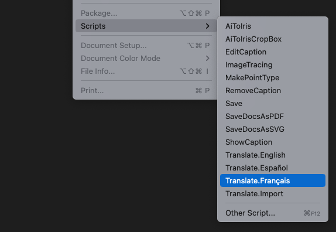
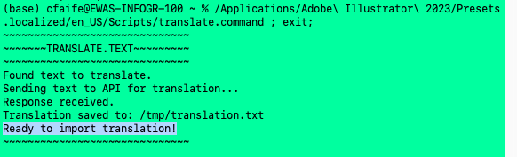
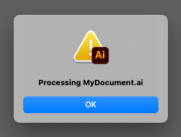

# TranslateAI
Export text from Adobe Illustrator files, send to machine translation services and re-import.

## Installation (Mac)

*NOTE: You will need to have administrator permissions on your machine to install the scripts.*

### Make command script executable 

For the translate function to work, the `translate.command` script must be made into an **executable file**. To do this you must run the "change mode" command, `chmod`, from terminal, with administrator permissions.

1) Open the Terminal application on your Mac

2) Type `chmod +x ` (make sure to press space once after `x`)

3) Click on the `translate.command` file in your Scripts folder, and drag it into the terminal window. You should now see the file location in the terminal after the `chmod` command.

4) Press enter. You should be prompted for your admin password. Type it in and hit enter. (You won't get any confirmation that it worked, but if the terminal starts a new line you're good.)

### Place scripts into Illustrator script folder

To run scripts from the **File > Scripts** menu in Illustrator, they must be placed in your **Scripts** directory.

The location should be something like:

> Applications > Adobe Illustrator {version_number} > Presets > {language} > Scripts

First make sure Illustrator is closed. Then move the `TranslateAi` folder into your Scripts directory.

You will be prompted to enter your password to do this.

### Allow apps from anywhere

Lastly, you'll need to configure your sytem to run software downloaded from outside of the App Store.

Go to:
> System Preferences > Security & Privacy > General

And select "Allow apps downloaded from: Anywhere"

Now you should be ready to run the script!

---

## Usage

* Open an Illustrator document containing text to be translated
* Click **File > Scripts > Translate.[Language]** to select the language you want to translate into.

* A terminal window will open. Wait until you get the message `"Ready to import translation"`

* Click **File > Scripts > Translate.Import**

You should see a confirmation of the document name. Click 'OK' and text should be re-imported into the document in the correct places.

