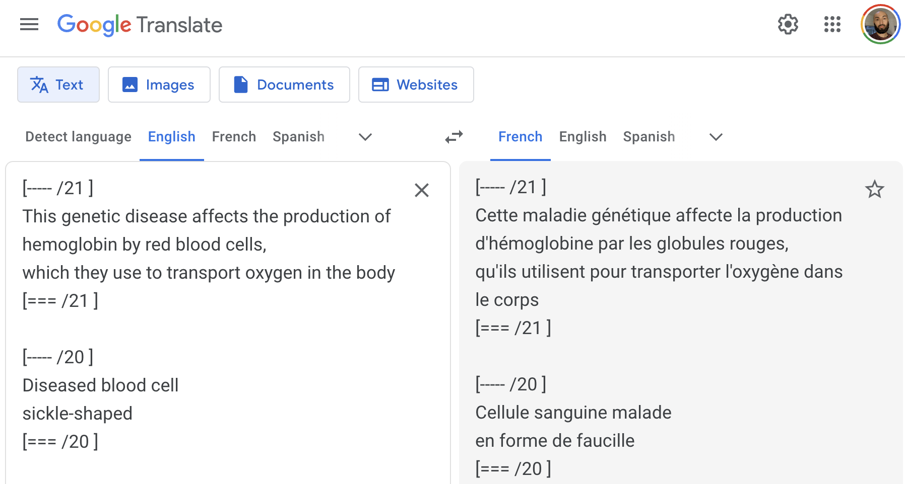

# Illustrator Text Convert
*Simple import-export functions for text in Adobe Illustrator files, to send to machine translation services and re-import.*

*Forked from an [original project by @Bramus](https://github.com/bramus/PS_BRAMUS.TextConvert) for Adobe Photoshop.*

## Installation

To access scripts from the **File > Scripts** menu within Illustrator, the two scripts (`TextConvert.Export.jsx`/`TextConvert.Import.jsx`) must first be placed in the **Scripts** folder.

File path may vary slightly but will resemble:

**Windows:**

> C:\Program Files\Adobe\Adobe Illustrator {version_number}\Presets\ {language} \Scripts\

**Mac**:

> Applications > Adobe Illustrator {version_number} > Presets > {language} > Scripts

## Usage

* Create a new directory within Documents (Mac) or My Documents (Win) called `TextConvert`.
* Open an Illustrator document containing text to be translated.
* Click **File > Scripts > TextConvert.Export**
    * Text from the Illustrator doc will be exported to a file inside `TextConvert` called `{Illustrator file name}.txt`
* Translate the contents of this text file and save it under the same file name (see below).    
    * Important: the translated file must maintain the section delimiters ("[----- /1 ]" and "[=== /1 ]" etc.)
* Click **File > Scripts > TextConvert.Import**
* The translated text will be reimported into the file in the correct places!

## Translation
### Translate from browser
When you export text from the Illustrator document, the new `.txt` file will open automatically.

The simplest thing to do is copy-paste everything from that file into Google Translate, copy-paste the translation back into the same text file and save it.

### Command line
If you prefer command line, translation can be done quickly with the [`translate-shell` application](https://github.com/soimort/translate-shell).

Note that:

* For `TextConvert` to work, translation output should overwrite the original input file. 
* `translate-shell` should also be run in "brief mode" (`-b` flag) to avoid introducing unwanted alternate translations.

With `translate-shell` installed, a sample command to translate a file into French would be:

`trans :fr -b -i myfile.txt -o myfile.txt`

*If you're using a command line workflow, in the CONFIG section of `TextConvert.Export.jsx` you may set `var openExport = false;` and the exported `.txt` file will not open automatically after you export.*

---
