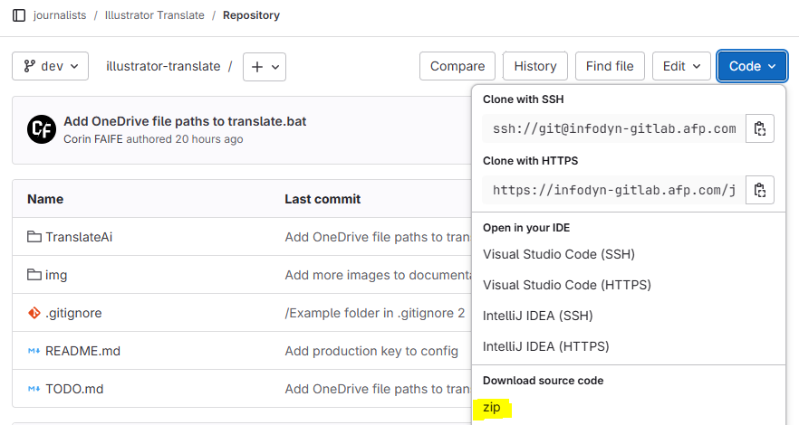
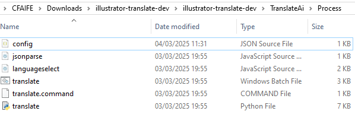
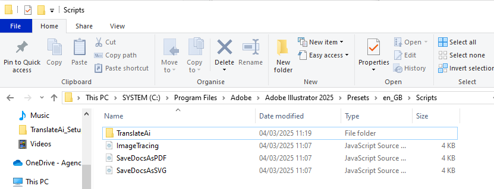
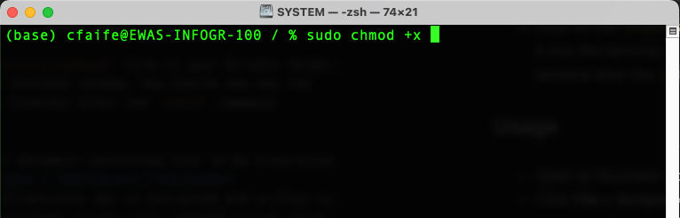
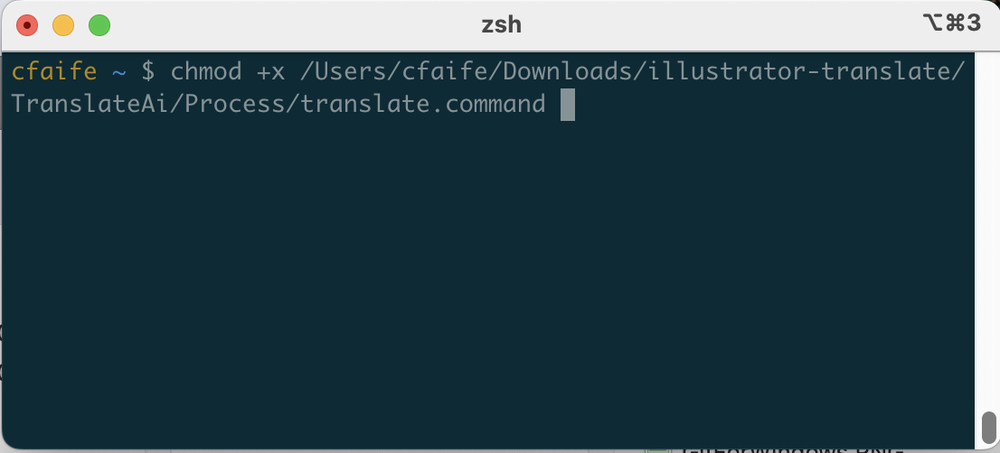
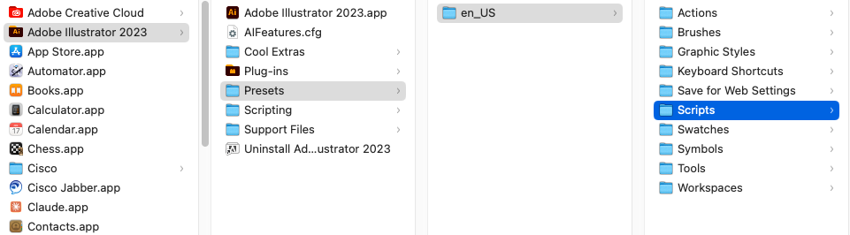
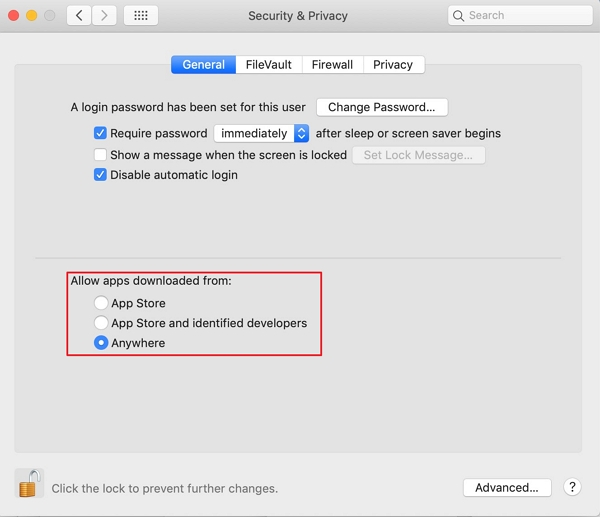
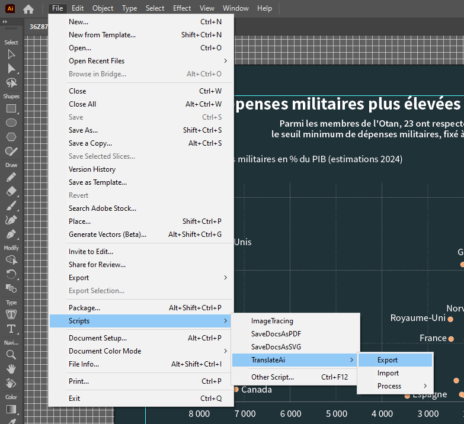

# TranslateAi: v0.3.1
**Export text from Adobe Illustrator files, send to translation API and re-import.**

## Installation (Windows)
### Download the code

Click on the blue **Code** box above, then Download source code: **zip**. (If you're familiar with Git you can also clone the repo instead.)

Extract the folder from the zip file – you can put it anywhere on your computer for now.

Open the zip file, find the TranslateAi folder, and put the `config.json` file (sent separately) into the `/src` folder.

Copy the TranslateAI folder into your Adobe Illustrator Scripts folder. The location will be something like:

`C:\Program Files\Adobe\Adobe Illustrator 202X\Presets\[language]\Scripts`

NOTE: You will need an administrator password to do this.

When the TranslateAI folder is inside the Scripts folder the translation script is installed. You will need to restart Illustrator to use it.

*Usage instructions follow Mac installation guide.*

## Installation (Mac)

*You will need to have administrator permissions on your machine to install the scripts.*

First, download the zip file as indicated in Windows installation instructions. Then:

### Make command script executable 

For the translate function to work, the `translate.command` script must be made an **executable file**. To do this you must run the "change mode" command, `chmod`, from terminal, with administrator permissions.

1) Open the Terminal application on your Mac

2) Type `sudo chmod +x ` (make sure to press space once after `x`)

3) Click on the `translate.command` file inside the `TranslateAi > Process` folder and drag it into the terminal. You should see the file location in the terminal after the `chmod` command.

4) Press enter. You should be prompted for your admin password. Type it in and hit enter. (You won't get any confirmation that it worked, but if the terminal starts a new line this is good.)

### Place scripts into Illustrator script folder

To run scripts from the **File > Scripts** menu in Illustrator, they must be placed in your **Scripts** directory.

The location should be something like:

> Applications > Adobe Illustrator {version_number} > Presets > {language} > Scripts

First make sure Illustrator is closed. Then move the `TranslateAi` folder into your Scripts directory.

You will be prompted to enter an administrator password to do this.

### Allow apps from anywhere

Lastly, you'll need to configure your sytem to run software downloaded from outside of the App Store.

Go to:
> System Preferences > Security & Privacy > General

And select "Allow apps downloaded from: Anywhere"

Now the tool should be ready to run.

----

## Running the script

### Install Python

If you don't already have Python installed, you will need to download it from the AFP app management portal.

You will also need to install the `requests` module.

When Python is installed, open the terminal / command prompt and type:

`pip install requests`

Then hit Enter to install.

### How to translate a graphic document

Open the graphic you want to translate. 

If you haven't already done so, save your work! Sometimes the script makes Illustrator freeze. I'm trying to fix this.

Click: `File > Scripts > TranslateAi > Export`

You should see a message telling you that text was exported.
 Click **OK**.

You will see a terminal window open while the translation script communicates with the [AFP translate API](https://translate.afp.com/translate). Meanwhile, an Illustrator menu will indicate the progress of the translation.

Once the translation server returns the text, it will be automatically re-imported into the Illustrator document.

**NOTE**: Sometimes you will see a message that says "Translate timed out.":

If this happens, run the TranslateAi > Export script again from Illustrator.