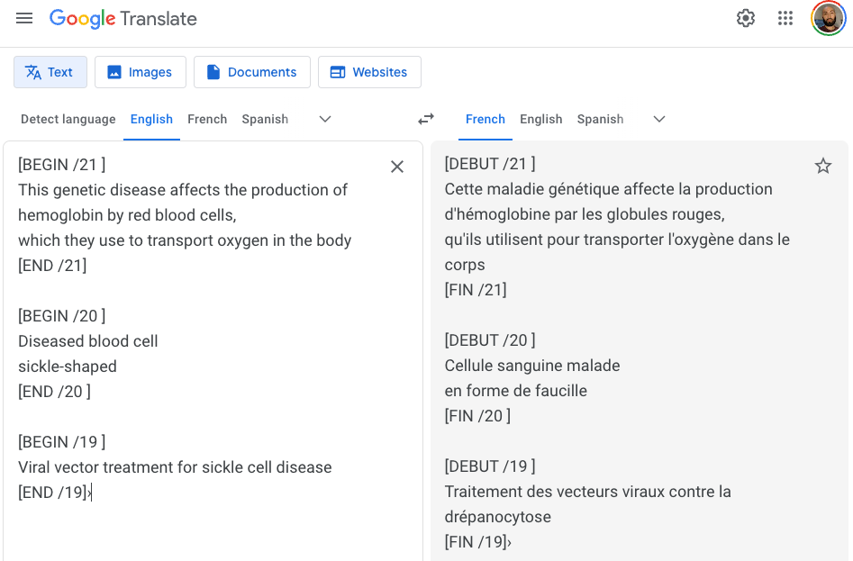

# Illustrator Text Convert
*Simple import-export functions for text in Adobe Illustrator files, to send to machine translation services and re-import.*

*Forked from an [original project by @Bramus](https://github.com/bramus/PS_BRAMUS.TextConvert).*

## Installation

To access scripts from the **File > Scripts** menu within Illustrator, they must first be placed in the **Scripts** folder.

File path may vary slightly but will resemble:

**Windows:**

> C:\Program Files\Adobe\Adobe Illustrator {version_number}\Presets\{language}\Scripts\

**Mac**:

> Applications > Adobe Illustrator {version_number} > Presets > {language} > Scripts

## Usage

* Create a new directory within Documents (Mac) or My Documents (Win) called `TextConvert`.
* Open an Illustrator document containing text to be translated.
* Click **File > Scripts > TextConvert.Export**
    * Text from the Illustrator doc will be exported to a file inside `TextConvert` called `{Illustrator file name}.txt`
* Translate the contents of this text file and save it under the same file name (see below).    
    * Important: the translated file must maintain the section delimiters ("[BEGIN /1 ]" and "[END /1 ]" etc.)
* Click **File > Scripts > TextConvert.Import**
* The translated text will be reimported into the file in the correct places!

## Translation

File translation can be done quickly from command line with the [`translate-shell` application](https://github.com/soimort/translate-shell).

* For `TextConvert` to work, translation output should overwrite the original input file. 
* `translate-shell` should also be run in "brief mode" (`-b` flag) to avoid introducing unwanted alternate translations.

So with `translate-shell` installed, a sample command to translate a file into French would be:

`trans :fr -b -i myfile.txt -o myfile.txt`

---

If you're not comfortable with command line you can just open the exported text file, copy the text into Google Translate, copy the translated text, paste it back into the text file and save.

